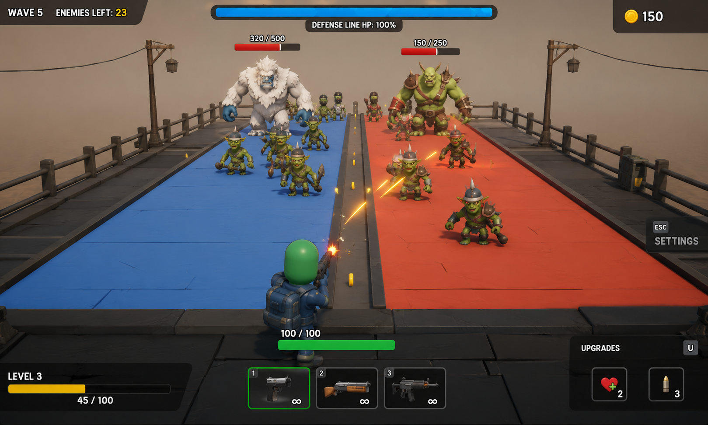

# RealRail Art Direction

`docs/art/visual-target.png` is RealRail's approved visual north star. It
defines the desired level of polish, readability, visual density, atmosphere,
and game-like presentation. It is a direction-setting reference, not a
pixel-perfect asset or layout specification.

## Camera and composition

- Use an angled, top-down gameplay camera that makes both lanes easy to read.
- Preserve a clear foreground player versus incoming-enemy relationship.
- Keep enemies legible at gameplay distance, including when they arrive in
  hordes.
- Compose scenes with depth and dimensionality; the arena should not read as
  flat prototype geometry.

## Arena and environment

Progressively evolve the arena from plain coloured rectangles into a believable
stylized 3D combat lane. Aim for defined lane surfaces, borders with thickness
and depth, a central divider integrated into the environment, surrounding
structure, environmental props, and enough background detail for the arena to
feel like a place. Extra detail must not weaken lane boundaries or gameplay
readability.

## Atmosphere and lighting

- Use coherent stylized lighting and shadows to reinforce form and depth.
- Add atmospheric depth or fog when it supports separation and scale.
- Maintain clear character/background separation.
- Target a polished, mobile-conscious presentation rather than realistic
  rendering.

## Enemy presentation and information

Enemy archetypes should communicate through distinct silhouettes, size, shape,
movement, animation, and presentation. Different creature families—humanoids,
monsters, creatures, robots, aliens, and beasts—are all valid when they share
a coherent visual language. The current Quaternius experiment is a useful
foundation, not a permanent art constraint.

Use close, readable enemy information selectively. Tougher enemies such as
Heavies should have health indicators above them; ordinary low-health horde
enemies should not acquire unnecessary UI clutter. Animation should feel fluid
and professional at the gameplay camera distance.

## Combat feedback

Build toward satisfying, readable feedback: visible projectiles or tracers,
muzzle feedback, hit impacts and reactions, death feedback, and appropriate
pickups or rewards. Firing through a horde should produce a strong visual
response without obscuring enemies or important play space.

## HUD

Use a modern HUD with clear hierarchy. Wave/progression information, player and
defense status, weapon information, and contextual details should be visually
organized and readable at a glance. Contextual information may sit near its
subject when that improves comprehension. The final HUD should follow actual
RealRail gameplay systems, not the reference's exact layout.

## Quality bar and interpretation

Stylized or low-poly does not mean prototype-looking. Simple, mobile-friendly
geometry and assets can still form a cohesive, intentional, polished game
presentation. Future visual work should reason from this reference's quality,
composition, readability, and atmosphere—not copy it literally.

The reference does **not** mandate its exact goblin or monster designs, player
character, weapons, environment props, HUD layout, colours, lighting, or any
other exact image replication.
